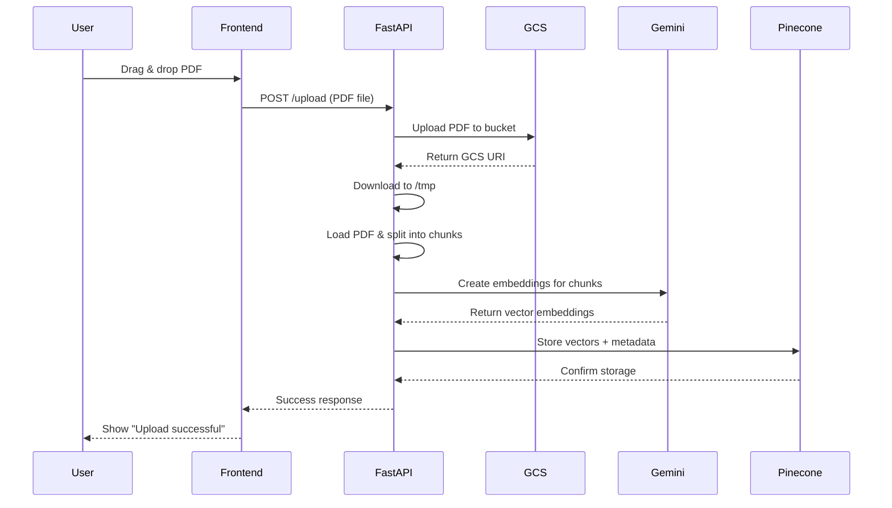
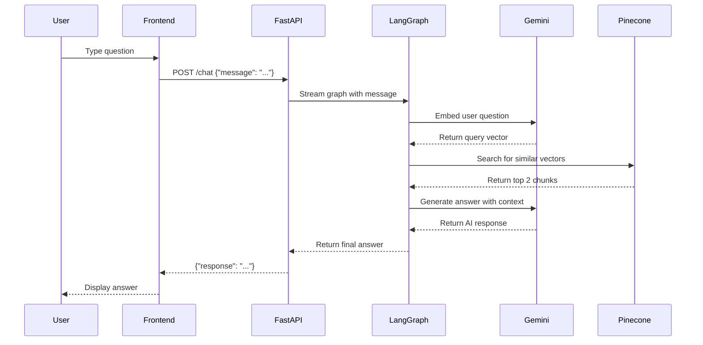

# DocChat Architecture - Component Interactions

## System Overview

Your DocChat application has 5 main components that work together:

1. **Frontend (React)** - User interface
2. **Backend (FastAPI)** - API server
3. **Google Cloud Storage (GCS)** - File storage
4. **Google Gemini** - AI model for embeddings and chat
5. **Pinecone** - Vector database for semantic search

---

## Flow 1: Uploading a PDF



### Detailed Steps

1. **User uploads PDF** via `FileUpload.jsx`
2. **Frontend** sends file to `http://localhost:8000/upload`
3. **FastAPI** (`api.py`):
   - Uploads PDF to GCS bucket `pdf-drop`
   - Downloads to `/tmp` for processing
   - Calls `ingest_pdf()` from `src/ingestion.py`
4. **Ingestion** (`src/ingestion.py`):
   - Loads PDF using `UnstructuredPDFLoader`
   - Splits into chunks using `RecursiveCharacterTextSplitter`
   - Sends chunks to Gemini for embedding
5. **Gemini** converts text chunks into 768-dimensional vectors
6. **Pinecone** stores vectors with metadata (filename, page number, etc.)

---

## Flow 2: Asking a Question



### Detailed Steps

1. **User types question** in `ChatInterface.jsx`
2. **Frontend** sends to `http://localhost:8000/chat`
3. **FastAPI** (`api.py`):
   - Calls `graph.stream()` from `src/graph.py`
4. **LangGraph** (`src/graph.py`) orchestrates the RAG workflow:
   - **Step 1**: `query_or_respond()` - Decides if retrieval is needed
   - **Step 2**: `retrieve()` from `src/retrieval.py` - Searches Pinecone
   - **Step 3**: `generate()` - Creates answer using retrieved context
5. **Retrieval** (`src/retrieval.py`):
   - Embeds user question using Gemini
   - Searches Pinecone for top 2 similar chunks
6. **Generation**:
   - Combines retrieved chunks with user question
   - Sends to Gemini with system prompt
   - Returns concise answer

---

## Component Details

### Frontend (`frontend/src/`)

**Files:**

- `App.jsx` - Main layout, manages state
- `FileUpload.jsx` - Handles PDF uploads
- `ChatInterface.jsx` - Handles chat messages

**What it does:**

- Provides UI for user interaction
- Makes HTTP requests to FastAPI backend
- Displays responses

### Backend (`fastApi/api.py`)

**Endpoints:**

- `GET /` - Health check
- `POST /upload` - Upload and process PDFs
- `POST /chat` - Answer questions

**What it does:**

- Receives HTTP requests from frontend
- Orchestrates file uploads to GCS
- Calls RAG pipeline for processing
- Returns responses to frontend

### RAG Pipeline (`src/`)

**Files:**

- `config.py` - Loads API keys from `.env`
- `ingestion.py` - PDF processing and vectorization
- `retrieval.py` - Semantic search tool
- `graph.py` - LangGraph workflow

**What it does:**

- Processes PDFs into searchable chunks
- Creates embeddings using Gemini
- Stores vectors in Pinecone
- Retrieves relevant context for questions
- Generates answers using AI

### Detailed RAG Explanation

**Concept:** RAG (Retrieval-Augmented Generation) solves the problem of LLMs not knowing about your private data.

**Step 1: Ingestion (The "Learning" Phase)**

1. **Chunking:** When a PDF is uploaded, `ingestion.py` splits the text into small chunks (~1000 characters).
2. **Embedding:** These chunks are sent to **Google Gemini** to create "embeddings" (vectors representing meaning).
3. **Storage:** These vectors are stored in **Pinecone**, our vector database.

**Step 2: Retrieval (The "Searching" Phase)**

1. **Query Embedding:** When a user asks a question, it is converted into a vector.
2. **Similarity Search:** We search Pinecone for chunks mathematically closest to the question's vector.

**Step 3: Generation (The "Answering" Phase)**

1. **Context Injection:** Relevant chunks are fed to Gemini along with the question.
2. **Prompting:** We instruct the AI: "Answer the user's question using ONLY this context."
3. **Result:** The AI answers accurately based on the document.

### External Services

**Google Cloud Storage:**

- Stores uploaded PDF files
- Provides persistent file storage
- Accessed via `google-cloud-storage` library

**Google Gemini:**

- Creates embeddings (text → vectors)
- Generates chat responses
- Accessed via `langchain-google-genai`

**Pinecone:**

- Vector database for semantic search
- Stores 768-dimensional embeddings
- Fast similarity search
- Accessed via `langchain-pinecone`

---

## Data Flow Summary

### Upload Flow

```
PDF → Frontend → FastAPI → GCS (storage) → FastAPI → 
Chunks → Gemini (embeddings) → Pinecone (vectors)
```

### Chat Flow

```
Question → Frontend → FastAPI → LangGraph → 
Gemini (embed) → Pinecone (search) → 
Gemini (generate) → FastAPI → Frontend → User
```

---

## Key Configuration

**Environment Variables (`.env`):**

```
GOOGLE_API_KEY=...           # For Gemini embeddings + chat
PINECONE_API_KEY=...         # For vector storage
GOOGLE_APPLICATION_CREDENTIALS=...  # For GCS access
```

**GCS Configuration (`api.py`):**

```python
GCS_BUCKET_NAME = "pdf-drop"
GCS_PROJECT_ID = "do-c-479403"
```

**Pinecone Configuration (`config.py`):**

```python
PINECONE_INDEX_NAME = "rag"
```

---

## Why This Architecture?

1. **Separation of Concerns**: Frontend, backend, and data storage are independent
2. **Scalability**: Each component can scale independently
3. **Cloud-Native**: Uses managed services (GCS, Pinecone, Gemini)
4. **Cost-Effective**: Pay only for what you use
5. **Production-Ready**: Can deploy to cloud easily

---

## Next Steps for Deployment

1. **Frontend** → Deployed to Vercel (free, automatic HTTPS)
2. **Backend** → Deployed to GCP E2 VM
3. **HTTPS Tunnel** → **Cloudflare Tunnel** used to expose local port 8000 securely to the internet (`https://...trycloudflare.com`) to resolve Mixed Content issues.
